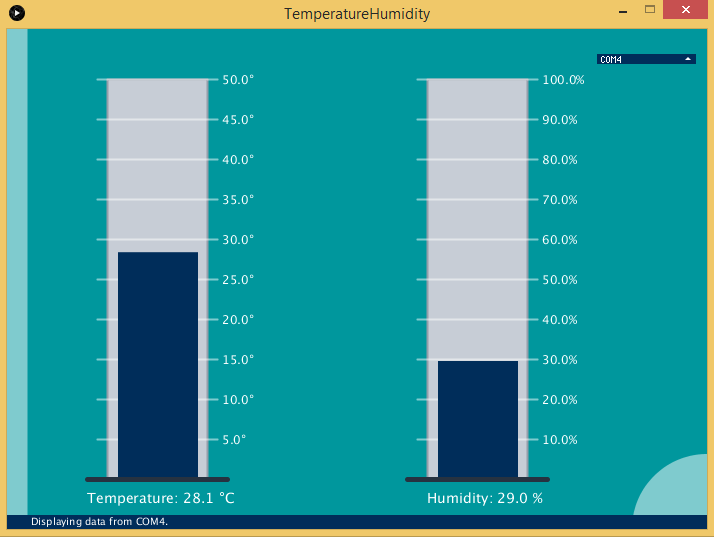

# Processing3_GUI_DHT11

A basic GUI for visualizing DHT11 sensor data collected by Arduino nano. 
Arduino nano reads the sensor data and sends them to PC through serial. The processing sketch reads the serial data from the COM port and draws temperature and humidity meters.

The end result looks like this:

How to install:
1. Connect the DHT11 sensor to Arduino Nano (Fritzing schematic is included)
2. Upload the Arduino sketch (REQUIRES the following Arduino libraries:  DHT Sensor Library, Adafruit Unified Sensor Lib)
3. Run the processing sketch (REQUIRES the following Processing libraries: ControlP5 Library)
4. Choose the COM port the arduino is connected to from the dropdown list.
